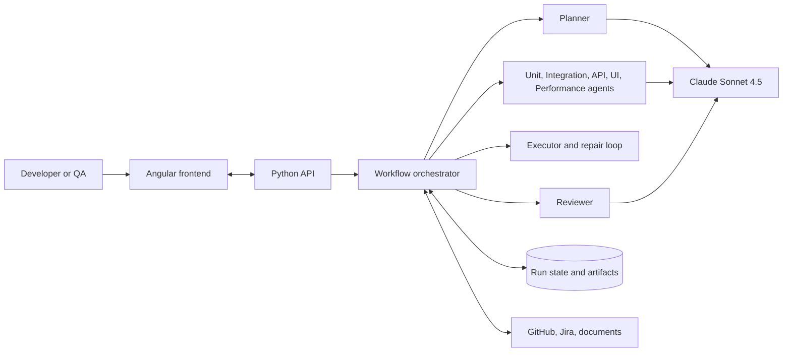

# AI Test Factory

AI Test Factory turns a Jira story, requirement document, or GitHub change into an approved, traceable test run. It uses Claude Sonnet 4.5 to plan coverage, generate tests, execute them, repair generated test assets within policy, and review the code and evidence.

## Current Status

The first Angular frontend slice is available under `frontend/`. It provides source intake for Jira stories, requirement documents, and GitHub pull requests or commits, plus repository context and a simulated Planner handoff.

The first contract-first backend slice is available under `backend/`. It accepts intake, creates a run in `awaiting_approval`, records approval decisions, and exposes shared QA and traceability schemas under `shared/schemas/`. The Claude provider and role-specific agent prompts are implemented behind the approval-gated agent endpoint; durable persistence and isolated test execution remain later delivery phases.

## Architecture



The Planner creates an editable plan and the backend pauses in `awaiting_approval`. Generation cannot begin until the user approves the plan. Rejection and edits are recorded in the audit history. The Executor may repair generated tests and fixtures within a retry limit, but it does not silently change product code or hide failures.

See the complete component, repository-boundary, state-machine, sequence, security, and delivery documentation in [docs/architecture.md](docs/architecture.md). See [specs/README.md](specs/README.md) for the specification layout.

## Repository Layout

```text
frontend/                 Angular application
backend/                  Python API and orchestration service
agents/                   Runtime agent contracts, prompts, and adapters
shared/                   Cross-layer schemas and API contracts
tests/                    Cross-service and end-to-end tests
docs/                     Architecture and operational documentation
.github/agents/           VS Code custom development agents
.github/instructions/     Coding and structure standards
.github/skills/           Reusable workflow skills
specs/                    Versioned QA specifications and test plans
```

VS Code custom-agent definitions under `.github/agents/` are development assistants. Runtime agent code belongs under `agents/` and must remain separate.

## Run the Frontend

Requirements: Node.js compatible with Angular 19 and npm.

```powershell
cd frontend
npm install
npm start -- --port 4200
```

Open `http://localhost:4200/`.

Build the frontend:

```powershell
cd frontend
npm run build
```

## Workflow

```text
intake -> inspecting -> plan_ready -> awaiting_approval
	-> approved -> generating -> executing -> completed
																	\-> repairing -> executing
	-> plan_rejected
```

The backend must enforce these transitions; frontend controls are not a security boundary.

## Coding Standards

Language-specific standards are available in `.github/instructions/` for Java, Angular, TypeScript, and JavaScript. The project structure guideline applies to all files. Agents must load the relevant standards before creating, editing, reviewing, or repairing code.
