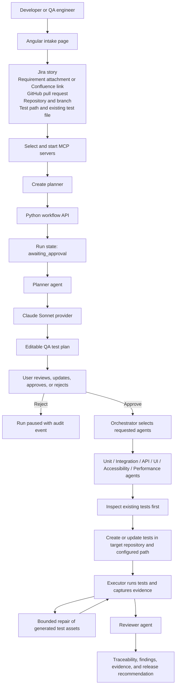

# AI Test Factory

AI Test Factory is a specification-driven QA workspace. A developer or QA engineer supplies a Jira story, requirement document, or GitHub pull request, selects the required test layers and MCP tools, and receives an editable test plan before any test-generation agent is allowed to work.

The system is designed to create or update tests inside the target repository. Existing tests are inspected first; when the user identifies an existing test file, agents preserve its cases and extend that same file whenever possible.

## Current Status

The current repository contains:

- An Angular intake and planner-review frontend.
- A Python approval-gated workflow API.
- A Claude Sonnet provider adapter using `ANTHROPIC_API_KEY` from the backend environment.
- Role-specific prompts for planner, unit, integration, API, UI, accessibility, performance, and reviewer work.
- Versioned JSON Schemas for QA specifications, test plans, and traceability records.
- Shared VS Code custom agents and reusable workflow skills.

Durable persistence, real Jira/GitHub/Confluence adapters, isolated test execution, artifact storage, and automatic specialist-agent orchestration are planned next phases.

## Architecture Flow



The backend is the source of truth. The frontend never authorizes generation by itself. The approval boundary is:

```text
intake -> inspecting -> plan_ready -> awaiting_approval
	-> approved -> generating -> executing -> completed
								  \-> repairing -> executing
	-> plan_rejected
```

See the detailed state machine, sequence diagram, boundaries, security rules, and delivery phases in [docs/architecture.md](docs/architecture.md).

## Repository Layout

```text
frontend/                 Angular operator interface
backend/                  Python API, Claude adapter, and orchestration foundation
agents/                   Runtime agent contracts and adapters (planned expansion)
shared/schemas/           Versioned framework-neutral JSON Schemas
tests/                    Cross-service and end-to-end tests (planned expansion)
specs/                    Versioned requirements, QA specs, and test plans
docs/                     Architecture and operational documentation
.github/agents/           VS Code custom-agent definitions
.github/instructions/     Repository and language instructions
.github/skills/           Reusable on-demand workflow skills
```

VS Code customizations under `.github/` must remain separate from runtime code under `agents/`.

## Validation

Frontend:

```powershell
npm --prefix frontend run build
npm --prefix frontend test -- --watch=false --browsers=ChromeHeadless
```

Backend:

```powershell
python -m unittest discover -s backend -p "test_*.py"
```

The backend tests cover approval gating, Claude request construction with a fake client, missing-key behavior, and role prompt selection. No validation command should report a model pass unless execution evidence supports it.

## User Workflow

1. Choose Jira, a requirement document, or a GitHub pull request.
2. Provide the source location. Documents support file attachments and Confluence links.
3. Provide repository name, local repository location, and target branch.
4. Provide the test output path and optional existing test file path.
5. Keep existing-test preservation enabled when the team maintains one shared test file.
6. Select at least one test layer: Unit, API, Integration, E2E/UI, Accessibility, or Performance.
7. Select MCP servers, enter endpoints, and start them before creating the planner.
8. Click **Create planner**.
9. Review the editable plan and save changes, approve, or reject it.
10. Specialist agents are unblocked only after explicit approval.

Required fields are marked with `*` and use Angular-specific messages instead of browser-native validation popups.

## Angular Frontend

The frontend is an operator interface. It collects input, displays workflow state, and sends typed requests to the Python API. It does not contain model credentials or make authorization decisions.

```text
frontend/src/app/
	app.component.*                 Shell and workflow orchestration
	app.config.ts                   Angular providers
	app.routes.ts                   Application routes
	components/
		source-intake/                Source and repository context form
		test-coverage/                Test-layer selection
		mcp-config/                   MCP selection and startup controls
		workflow-stepper/             Step states and activity log
		planner-review/               Editable plan and approval actions
	models/                         Frontend view models
	services/                       Typed API services
```

Run the frontend:

```powershell
cd frontend
npm install
npm start -- --port 4200
```

Open `http://localhost:4200/`.

Build and test it:

```powershell
npm run build
npm test -- --watch=false --browsers=ChromeHeadless
```

## Backend and Claude

The backend lives under `backend/`. The current local API uses Python's standard library and exposes:

```text
POST /runs                         Create an awaiting-approval run
GET  /runs/{runId}                 Read run state and approval history
POST /runs/{runId}/approval        Approve or reject a plan
POST /runs/{runId}/agent-runs      Run a role-specific Claude agent after approval
```

Configure Claude in the backend process:

```powershell
pip install -r backend/requirements.txt
$env:ANTHROPIC_API_KEY = 'your-api-key'
$env:CLAUDE_MODEL = 'claude-sonnet-4-5'
python backend/app.py
```

The API key is never sent to the browser, stored in source, or committed. The provider is implemented in [backend/claude_provider.py](backend/claude_provider.py), and role prompt selection is implemented in [backend/agent_service.py](backend/agent_service.py).

## Agents

### Runtime agents

Runtime agents are application capabilities invoked by the backend orchestrator. Their contracts belong under `agents/` and their outputs are represented by shared schemas and artifacts.

- **Planner**: normalizes requirements, repository context, acceptance criteria, risks, and test strategy.
- **Unit**: creates focused deterministic unit tests.
- **Integration**: tests service, database, queue, cache, and external boundaries.
- **API**: tests contracts, authentication, authorization, validation, errors, and compatibility.
- **UI/E2E**: tests user journeys, browser behavior, and accessible selectors.
- **Accessibility**: tests semantic structure, keyboard behavior, focus, announcements, contrast, and WCAG-related behavior.
- **Performance**: defines workloads, thresholds, latency, throughput, and resource expectations.
- **Executor**: runs tests, captures evidence, classifies failures, and performs bounded repairs to generated assets.
- **Reviewer**: checks correctness, traceability, security, flakiness, coverage gaps, and release readiness.

### VS Code custom agents

`.github/agents/*.agent.md` are development assistants, not runtime implementations. The Builder coordinates broad implementation work; Planner, Executor, Reviewer, and the specialist agents provide focused workflows with different tool permissions and output contracts.

## Skills

Skills are reusable procedures shared by agents. They remove duplicated guidance without replacing role-specific agents.

- `repository-standards`: preserve repository boundaries and load the applicable coding standard.
- `approved-plan`: enforce editable plans, human approval, scoped work, and auditable decisions.
- `evidence-reporting`: record commands, exit codes, artifacts, logs, and verified outcomes.
- `bounded-repair`: constrain repairs to generated tests, fixtures, selectors, setup, or approved configuration.

Skills live under `.github/skills/<skill-name>/SKILL.md`.

## Instructions

Workspace instructions define repository and language conventions:

- `project-structure.instructions.md`: canonical frontend, backend, runtime-agent, shared, test, documentation, customization, and specification boundaries.
- `angular-coding-standard.instructions.md`: standalone components, strict templates, accessibility, services, tests, and Angular validation.
- `typescript-coding-standard.instructions.md`: precise types, strictness, explicit async behavior, and safe external boundaries.
- `javascript-coding-standard.instructions.md`: JavaScript runtime and configuration conventions.
- `java-coding-standard.instructions.md`: Java application and test conventions.

Agents should load the matching instruction before creating, editing, reviewing, or repairing code.

## Specifications and Contracts

Specifications are versioned under `specs/`:

```text
specs/<requirement-id>/
	requirement.md
	qa-spec.json
	test-plan.json
```

Shared schemas live under `shared/schemas/`:

- `qa-spec.schema.json`: acceptance criteria, risks, and requested test strategy.
- `test-plan.schema.json`: specialist tasks, priorities, pass criteria, assumptions, and approval status.
- `traceability.schema.json`: links each test and evidence result to a specification and acceptance criterion.

The intended traceability chain is:

```text
Requirement -> QA specification -> Acceptance criterion -> Test plan task
		-> Test file -> Execution result -> Evidence -> Review finding
```

See [specs/README.md](specs/README.md) for specification authoring rules and [docs/architecture.md](docs/architecture.md) for the detailed state machine and sequence.
