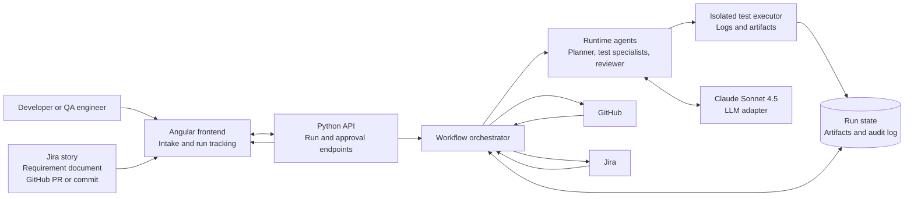
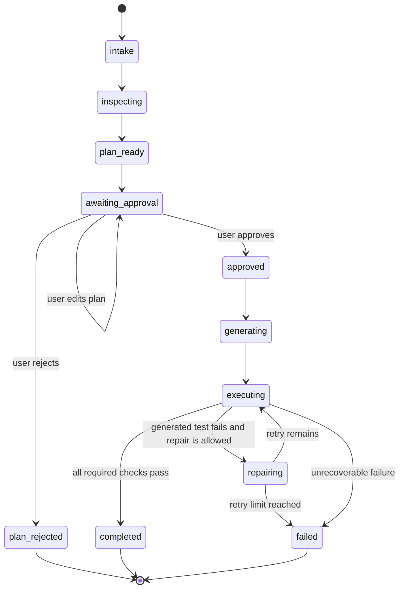
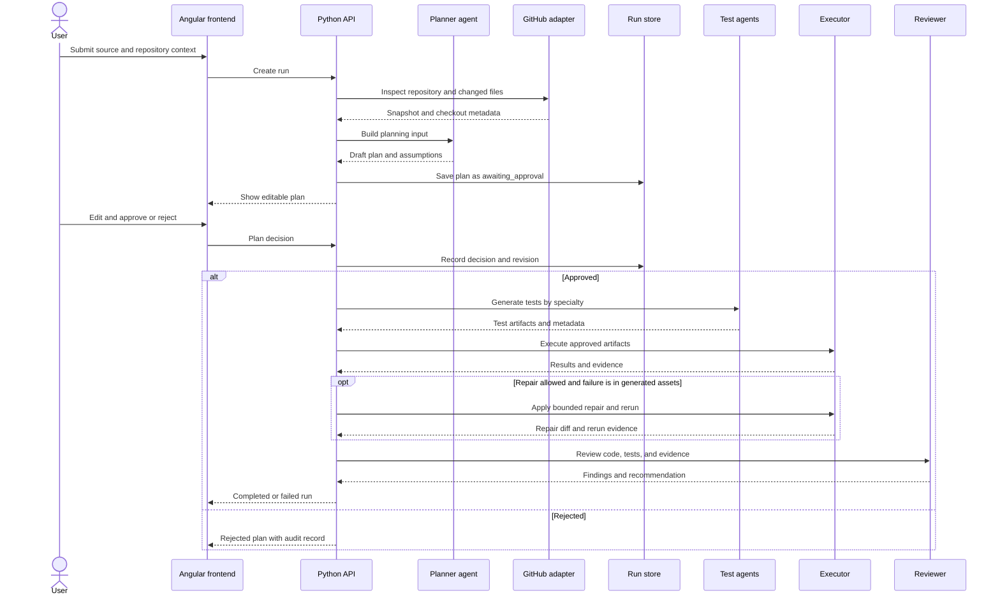

# AI Test Factory Architecture

## Purpose

AI Test Factory turns a Jira story, requirement document, or GitHub change into an auditable test run. It plans the work, waits for human approval, delegates generation to specialist agents, executes the generated tests, repairs only generated test assets within policy, and reviews the result.

The system uses Angular for the frontend and Python for the API and orchestration service. Claude Sonnet 4.5 is the configured model, accessed through a provider adapter so model access remains replaceable.

## System Context



## Repository Boundaries

```text
frontend/                 Angular application and frontend tests
backend/                  Python API, orchestration, integrations, and backend tests
agents/                   Runtime agent contracts, prompts, and adapters
  planner/
  unit/
  integration/
  api/
  ui/
  performance/
  reviewer/
  executor/
shared/                   Versioned, framework-neutral schemas and API contracts
tests/                    Cross-service and end-to-end tests
  unit/
  integration/
  api/
  ui/
  performance/
docs/                     Architecture and operational documentation
.github/agents/           VS Code development-agent definitions
.github/instructions/    Coding and structure standards
```

`.github/agents/` contains development assistants. It is separate from `agents/`, which contains runtime application code used by the Python service.

## Main Components

### Angular frontend

The frontend is the operator workspace. It owns presentation state and calls the Python API; it does not make agent, GitHub, Jira, or model decisions itself.

Initial page:

- Source intake for Jira, requirement documents, and GitHub changes.
- Repository and branch context.
- Optional direction for risk areas or user journeys.
- Visible notice that the Planner must pause for approval.
- Local preview of the intake handoff until the backend endpoint is connected.

Planned pages and views:

- Run dashboard with workflow state and agent status cards.
- Editable planner output with approve, reject, and update actions.
- Generated artifacts, execution logs, retries, and test results.
- Reviewer findings with severity and file references.

### Python API and orchestrator

The backend is the source of truth for workflow state and authorization of transitions. Suggested modules:

- `backend/api/`: HTTP routes, request validation, authentication, and error mapping.
- `backend/domain/`: run, plan, agent status, artifact, finding, and transition models.
- `backend/orchestration/`: state machine, planning, delegation, execution, and repair policy.
- `backend/integrations/`: GitHub, Jira, document parsing, model, runner, and artifact storage adapters.
- `backend/repositories/`: persistence interfaces and implementations.

The API must enforce the approval gate even if a client bypasses the Angular UI.

### Runtime agents

Each runtime agent has a typed input and output contract, a narrow responsibility, and an explicit status. The runtime agents are:

- Planner: normalizes source input and produces an editable plan.
- Unit: generates focused unit tests.
- Integration: covers component and dependency boundaries.
- API: covers endpoint and contract behavior.
- UI: covers browser user journeys and accessibility-critical behavior.
- Performance: defines workloads and measurable thresholds.
- Reviewer: evaluates code, generated tests, evidence, and risks.
- Executor: runs tests, classifies failures, and performs bounded repairs to generated assets.

Agents must not share hidden mutable state. They communicate through versioned contracts and stored artifacts.

### Shared contracts

`shared/` contains framework-neutral schemas for:

- Source input and repository snapshot.
- Test plan, acceptance criteria, assumptions, and approval history.
- Agent run status and timestamps.
- Generated test artifact metadata.
- Execution result, logs, traces, screenshots, and coverage.
- Repair attempt and diff summary.
- Reviewer finding and recommendation.

The Angular client may generate types from these contracts, but the backend remains authoritative for validation.

## Workflow State Machine



The backend records every transition, actor, timestamp, reason, and plan revision. No generation or execution can begin from `awaiting_approval`.

## End-to-End Sequence



## Safety and Governance

- Credentials are supplied through environment or secret-management configuration and are never stored in the browser or source.
- GitHub checkouts and document ingestion run with least-privilege access and bounded input size.
- Generated files are validated before execution and stored separately from production source.
- Automatic repair may change generated tests, fixtures, and test configuration only. Product-code changes require an explicit, reviewable policy.
- Every pass, failure, skip, block, repair, and inconclusive result includes execution evidence.
- Performance tests require a declared target environment and workload budget to prevent accidental load against shared systems.

## Delivery Phases

1. **Frontend intake:** Angular source intake page and typed mock handoff are implemented.
2. **Contracts and API:** Add versioned shared schemas and Python endpoints for runs, plans, decisions, agents, artifacts, and findings.
3. **Planner and inspection:** Add GitHub, Jira, and document adapters plus the approval-gated planner flow.
4. **Generation:** Connect the five testing specialists and reviewer through runtime contracts.
5. **Execution:** Add isolated runners, evidence storage, classification, and bounded generated-test repair.
6. **Operations:** Add authentication, webhook or polling triggers for GitHub check-ins, observability, retention, and deployment automation.
